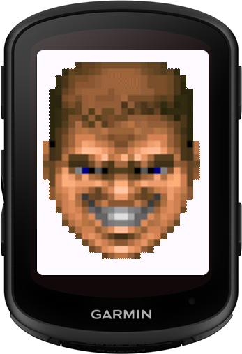

# DoomFace DataField for Garmin Edge 1050

[](https://developer.garmin.com/connect-iq/)
[](LICENSE)

A Garmin Connect IQ Data Field that displays the classic DOOM face sprites based on your heart rate zone intensity during cycling. The longer you push yourself, the more stressed the DOOM guy becomes!



## 🎮 Features

- **Real-time HR Zone Monitoring**: Automatically detects and tracks time spent in each heart rate zone
- **Classic DOOM Face Sprites**: Six different face expressions from happy to bloody
- **30-Second Zone Threshold**: Face changes after maintaining a zone for 30+ seconds
- **Automatic HR Zone Detection**: Pulls your personalized HR zones from your Garmin profile
- **Current Stats Display**: Shows current heart rate and zone number

## 📋 Requirements
- **Device**: Garmin Edge 540, 840, Explore 2, 1040, 1050
- **Connect IQ SDK**: Version 4.0.0 or higher
- **API Level**: 4.0.0 minimum
- **Development Tools**: 
  - Visual Studio Code (recommended)
  - Monkey C Extension for VS Code
  - Connect IQ SDK command line tools

## 🚀 Installation

### For Users (Installing the PRG file)

1. Download the compiled `DoomFaceForEdge.prg` file from releases
2. Connect your Edge to your computer
3. Copy the PRG file to your device's `GARMIN/APPS` folder
4. Restart your Edge 1050
5. Add the DoomFace data field to your activity profile

### For Developers (Building from Source)

1. **Clone the repository**
   ```bash
   git clone https://github.com/wendlers/DoomFaceForEdge.git
   cd DoomFaceForEdge
   ```

2. **Install Connect IQ SDK**
   - Download from [Garmin Developer Portal](https://developer.garmin.com/connect-iq/sdk/)
   - Set up your development environment following Garmin's guide

4. **Build the project**
   ```bash
   monkeyc -d edge1050 -f monkey.jungle -o DoomFace.prg -y developer_key
   ```

5. **Test in simulator**
   ```bash
   monkeydo DoomFace.prg edge1050
   ```

## 📁 Project Structure

```
DoomFace/
├── manifest.xml                    # App configuration
├── monkey.jungle                   # Build configuration
├── source/
│   ├── DoomFaceApp.mc            # Main application class
│   └── DoomFaceView.mc           # Data field view and logic
├── resources/
│   ├── drawables/
│   │   ├── drawables.xml         # Drawable resource definitions
│   │   ├── launcher_icon.png    # 40x40 app icon
│   │   └── doom_face_*.png      # face sprites (1-6) in different resolutions
│   ├── layouts/
│   │   └── layout.xml           # UI layout definition
│   └── strings/
│       └── strings.xml          # String resources
└── README.md                     # This file
```

## 🎯 How It Works

### Heart Rate Zones

The data field uses your Garmin profile's cycling HR zones:

| Zone | Name | Doom Face | Description |
|------|------|-----------|-------------|
| 1 | Recovery | 😊 Normal | Easy recovery pace |
| 2 | Base | 😐 Slightly stressed | Aerobic base building |
| 3 | Tempo | 😟 Stressed | Tempo/Sweet spot |
| 4 | Threshold | 😣 Very stressed | Lactate threshold |
| 5 | VO2 Max | 😖 Damaged | Maximum oxygen uptake |
| 6 | Anaerobic | 🩸 Bloody | Sprint/Neuromuscular power |

### Zone Timing Logic

1. The app continuously monitors your current heart rate
2. When you enter a new zone, a timer starts
3. After 30 seconds in the same zone, the face updates
4. If you change zones, the timer resets
5. The face always reflects the zone you've been in for 5+ seconds

## 🛠️ Configuration

### Default HR Zones

If no custom zones are set in your Garmin profile, the app uses these defaults:
- Zone 1: < 100 bpm
- Zone 2: 100-120 bpm
- Zone 3: 120-140 bpm
- Zone 4: 140-160 bpm
- Zone 5: 160-180 bpm
- Zone 6: > 180 bpm

### Customizing Zone Threshold

To change the 5-second threshold, modify this line in `DoomFaceView.mc`:
```javascript
private const ZONE_THRESHOLD = 5; // seconds
```

## 🐛 Troubleshooting

### Data field not showing up
- Ensure the PRG file is in the correct folder (`GARMIN/APPS`)
- Restart your Edge
- Check that the app is enabled in Connect IQ settings

### Face not changing
- Verify your heart rate sensor is connected and working
- Check that you're maintaining the zone for 5+ seconds
- Ensure HR zones are properly configured in your Garmin profile

## 📝 Development Notes

### Memory Optimization
- Images are loaded once during `onLayout()` to minimize memory usage
- Zone timers use simple integer arrays for efficiency
- Minimal computation during `onUpdate()` for smooth rendering

### Testing
Test the data field using the Connect IQ simulator:
1. Set different HR values to test zone changes
2. Use time acceleration to test the 5-second threshold
3. Test with and without defined HR zones

## 🤝 Contributing

Contributions are welcome! Please feel free to submit a Pull Request. For major changes:

1. Fork the repository
2. Create your feature branch (`git checkout -b feature/AmazingFeature`)
3. Commit your changes (`git commit -m 'Add some AmazingFeature'`)
4. Push to the branch (`git push origin feature/AmazingFeature`)
5. Open a Pull Request

## 📄 License

This project is licensed under the MIT License - see the [LICENSE](LICENSE) file for details.

## 🙏 Acknowledgments

- id Software for the iconic DOOM face sprites
- Garmin Connect IQ development team
- The cycling and Connect IQ developer community

## 📮 Support

For issues, questions, or suggestions:
- Open an issue on GitHub
- Check the [Garmin Developer Forums](https://forums.garmin.com/developer/)
- Review the [Connect IQ Documentation](https://developer.garmin.com/connect-iq/api-docs/)

## 🗺️ Roadmap

- [ ] Power zone support as alternative to HR zones
- [ ] Animation transitions between faces

---

**Disclaimer**: DOOM and DOOM face sprites are trademarks of id Software/Bethesda. This is a fan project for personal use.